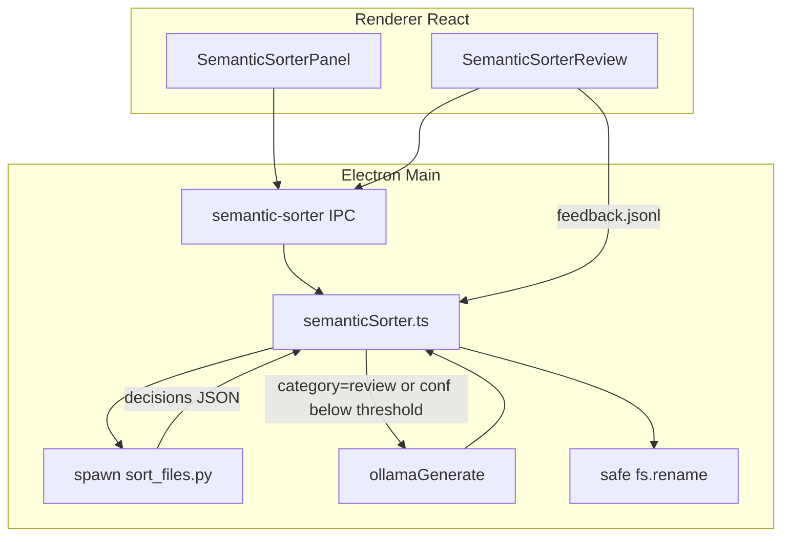

# Semantic Sorter in Task Assistant

Integration plan and architecture reference. **Status: implemented** (v1).

## Answer

**Yes — this is a good fit for Task Assistant**, but **do not embed Tkinter inside Electron**. Tkinter is a separate desktop toolkit; mixing it with an Electron/React app gives you two UIs, awkward window management, and packaging pain.

Instead:

- **Move** the Python sorter into `task-assistant/semantic-sorter/`
- **Reimplement** `review_gui.py` as a React panel (accept / correct / skip, writes `feedback.jsonl`)
- **Add Ollama** on top using the same pattern as `electron/main/workplace/workplaceFilePicker.ts` + `electron/main/ollamaClient.ts`



## What already exists (reuse)

| Piece | Location | Reuse |
| ----- | -------- | ----- |
| Rule/knowledge classifier | `semantic-sorter/sort_files.py` | JSON output for IPC via `--emit-json` |
| Knowledge + destinations | `semantic-sorter/knowledge.example.json`, `destinations.example.json` | Defaults copied to app user data |
| Ollama JSON calls | `electron/main/ollamaClient.ts` | Same helper |
| Folder picker | `semantic-sorter-pick-folder` IPC | Dedicated folder picker |
| Feature kernel | `electron/main/features/kernel/register.ts` | `semanticSorter` manifest |
| Settings persistence | `~/Library/Application Support/task-assistant/data.json` | `settings.semanticSorter` block |

## File consolidation

**Live in** `task-assistant/semantic-sorter/`:

- `sort_files.py`
- `review_gui.py` (CLI fallback; UI replaced by React)
- `knowledge.example.json`, `destinations.example.json`
- `run_sort_inbox_apply.sh`, `run_personal_onedrive_dry_run.sh`
- `sample-reports/` — example dry-run CSV/MD artifacts

**GigiApps** keeps a deprecation stub at `tools/semantic_sorter/README.md`.

**Runtime data** (not in repo): `~/Library/Application Support/task-assistant/semantic-sorter/{knowledge.json,feedback.jsonl,last-run.csv}`

## Hybrid sorting pipeline

1. **Rule engine (Python)** runs first via `python3 semantic-sorter/sort_files.py --emit-json ...` (no file moves in this step).
2. **Ollama augment** in Electron main for rows where:
   - `category === "review"`, or
   - `confidence < semanticSorter.ollamaThreshold` (default `0.62`, matching Python logic)
3. **Prompt** includes: filename, path context, extension, optional text excerpt, allowed categories from knowledge destinations, and alias hints.
4. **Expected JSON** (same style as workplace picker):

```json
{
  "category": "uni",
  "destination": "HS-Hannover/Uni/Rechnungswesen",
  "confidence": 0.78,
  "reason": "filename matches course alias ReWeBelle",
  "tags": ["accounting", "uni"]
}
```

5. **Guardrails**: reject categories not in knowledge map; cap confidence; if Ollama fails → keep rule-engine `review`.
6. **Apply moves** only from Electron main with the same safety rules as Python today: dry-run default, no overwrite, unique destination names, skip dotfiles.

## UI (replaces Tkinter)

Top-level nav view **Desktop Sorter** in `src/App.tsx` (alongside Analytics / Settings):

**`SemanticSorterPanel.tsx`**

- Pick sort inbox folder (e.g. OneDrive `_Sort Inbox`)
- Pick destination roots (personal / HS-Hannover)
- **Dry run** → table of proposed moves (script vs Ollama-augmented, confidence, reason)
- **Apply** (confirm dialog)
- Open review flow

**`SemanticSorterReview.tsx`** (port of review_gui)

- Row-by-row: Accept script / Save correction / Skip
- Editable category, destination, tags, note
- Appends to `feedback.jsonl` (same schema as before)

**`SettingsPanel.tsx`** additions:

- Feature flag toggle `semanticSorter`
- Paths and thresholds editable in Desktop Sorter view

## Electron main module

Folder: `electron/main/semanticSorter/`

| File | Role |
| ---- | ---- |
| `semanticSorter.ts` | Orchestrate dry-run, Ollama augment, apply, feedback load |
| `semanticSorterPaths.ts` | Resolve user-data paths, validate roots (mirror `workplacePaths.ts`) |
| `semanticSorterOllama.ts` | Prompt + parse + validate Ollama classification |
| `semanticSorterTypes.ts` | Shared decision/result types |
| `electron/main/features/semanticSorter/manifest.ts` | Register feature module at order ~45 |

**IPC handlers** (preload v10+):

- `semantic-sorter-dry-run`
- `semantic-sorter-apply`
- `semantic-sorter-save-feedback`
- `semantic-sorter-pick-folder`
- `semantic-sorter-get-settings` / `semantic-sorter-update-settings`

## Python changes

In `semantic-sorter/sort_files.py`:

- `--emit-json` → print `Decision[]` as JSON on stdout (for Electron)
- `--decisions-only` → skip tab-separated log lines when invoked from app
- CLI/Hazel scripts use updated paths under `task-assistant/semantic-sorter/`

## Feature flag wiring

`FeatureId` includes `semanticSorter`; label in `src/features/types.ts`; manifest in `electron/main/features/kernel/register.ts`.

## Out of scope for v1

- Hazel automation (document path update only; user can re-point script to task-assistant location)
- Embedding-based ML classifier (dtag-style); hybrid rules + Ollama is enough for v1
- Drag-and-drop onto the Electron window (v2: native drop zone on inbox path)

## Risks / mitigations

| Risk | Mitigation |
| ---- | ---------- |
| Python not on PATH in packaged app | `pythonPath` in settings; document dev dependency; optional future PyInstaller sidecar |
| OneDrive partial sync | Keep 2-minute delay recommendation; dry-run before apply |
| Ollama hallucinated destinations | Whitelist categories/destinations from knowledge JSON |
| Moving files breaks Hazel | Stub README in GigiApps with new script paths |

## Test plan

1. Run `sort_files.py --emit-json` standalone from task-assistant dir
2. Dry-run Desktop or `_Sort Inbox` sample files; verify review items get Ollama suggestions
3. Review UI: accept + correct → `feedback.jsonl` → second dry-run picks up learned row
4. Apply on test folder; confirm no overwrite and `_Needs Review` routing
5. Ollama offline: rule engine still works; augment gracefully skipped

## Quick usage

```bash
cd task-assistant
npm run electron:dev
```

Open **Desktop Sorter** in the sidebar. See also [`semantic-sorter/README.md`](../semantic-sorter/README.md) for CLI/Hazel usage.
